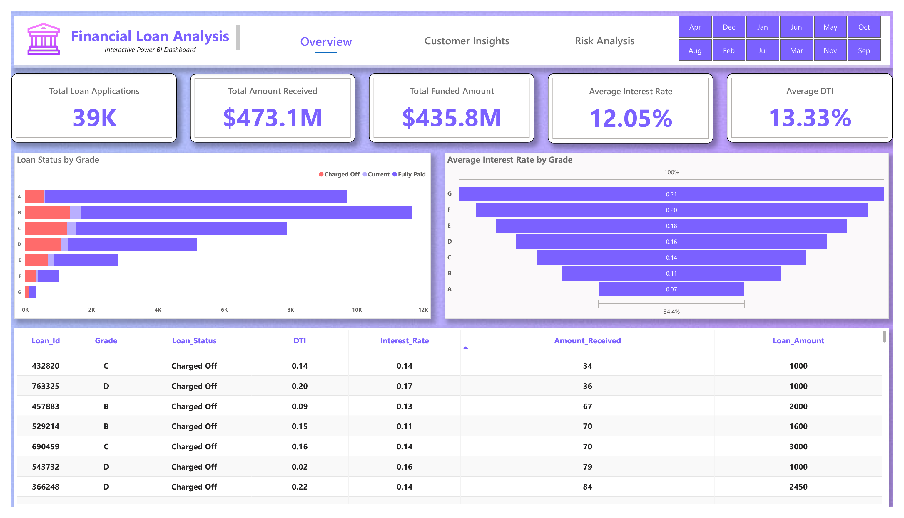
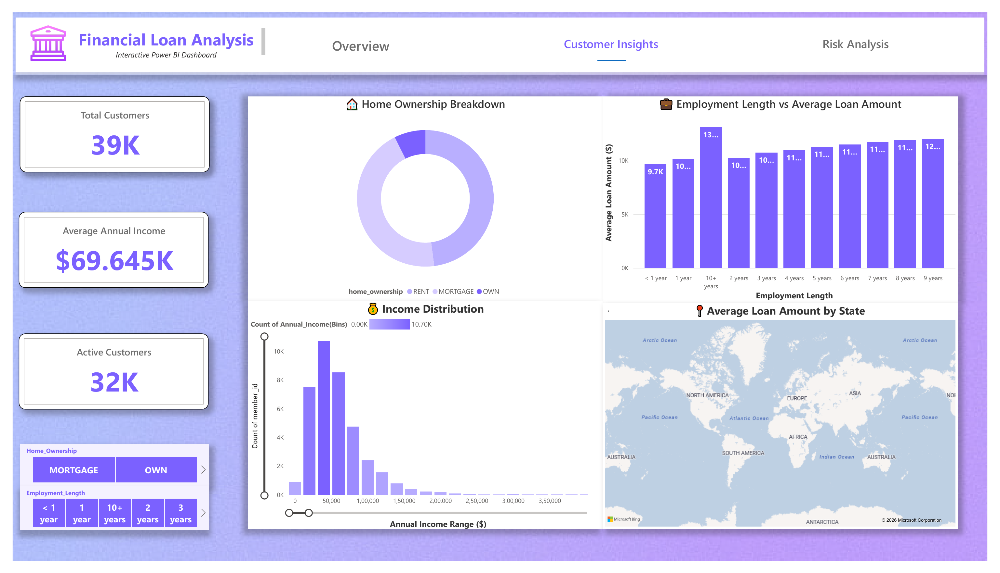
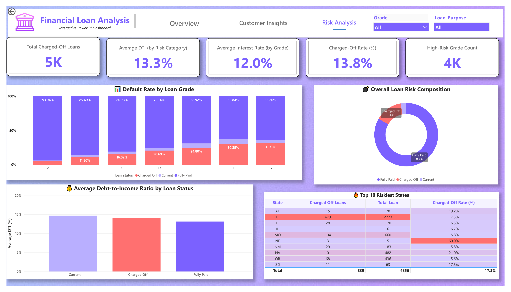

# 📊 Financial Loan Analysis – Power BI Dashboard

An interactive Power BI dashboard designed to analyze **loan performance, customer characteristics, and portfolio risk** using financial loan data.

## 📌 Project Overview

This project analyzes loan applications from multiple perspectives, including:

- Loan application and funding performance
- Customer demographics and financial characteristics
- Loan grades and interest rates
- Loan repayment status
- Default and charged-off rates
- Debt-to-income (DTI) ratios
- Geographic loan risk
- Employment and home ownership patterns

The dashboard is organized into three main analytical sections:

**Loan Overview → Customer Insights → Risk Analysis**

---

## 🛠️ Tools & Technologies

- **Power BI**
- **DAX**
- **Power Query**
- **Data Modeling**
- **Data Visualization**
- **Financial & Risk Analysis**

---

## 📊 Dashboard Pages

### 1. Loan Overview

The Overview page provides a high-level view of the loan portfolio.

**Key KPIs:**

| Metric | Value |
|---|---:|
| Total Loan Applications | 39K |
| Total Funded Amount | $435.8M |
| Total Amount Received | $473.1M |
| Average Interest Rate | 12.05% |
| Average DTI | 13.33% |

The page also analyzes:

- Loan status by grade
- Average interest rate by grade
- Loan-level details
- Monthly filtering

---

### 2. Customer Insights

The Customer Insights page focuses on customer characteristics and loan behavior.

**Key KPIs:**

| Metric | Value |
|---|---:|
| Total Customers | 39K |
| Average Annual Income | $69.645K |
| Active Customers | 32K |

The page includes analysis of:

- Home ownership
- Employment length
- Average loan amount by employment length
- Annual income distribution
- Average loan amount by state

---

### 3. Risk Analysis

The Risk Analysis page focuses on identifying loan portfolio risk.

**Key KPIs:**

| Metric | Value |
|---|---:|
| Total Charged-Off Loans | 5K |
| Average DTI | 13.3% |
| Average Interest Rate | 12.0% |
| Charged-Off Rate | 13.8% |
| High-Risk Grade Count | 4K |

The page analyzes:

- Default rate by loan grade
- Overall loan risk composition
- Average DTI by loan status
- Top 10 riskiest states
- Charged-off loan patterns
- Grade and loan-purpose filtering

---

## 🖼️ Dashboard Preview

### Loan Overview



### Customer Insights



### Risk Analysis



---

## 🔍 Key Observations

The dashboard provides visibility into several portfolio-level patterns, including:

- Loan performance varies across different loan grades.
- Interest rates differ by loan grade.
- Charged-off rates can be compared across grades and geographic regions.
- Customer income, employment length, and home ownership can be analyzed alongside loan characteristics.
- DTI can be examined across different loan repayment statuses.

---

## 📁 Repository Contents

```text
powerbi-dashboard-project/
│
├── Images/
├── screenshots/
│   ├── loan-overview.png
│   ├── customer-insights.png
│   └── risk-analysis.png
│
├── Final PBI Project.pbix
└── README.md

## 🎯 Skills Demonstrated

- Power BI
- DAX
- Power Query
- Data Modeling
- Data Visualization
- KPI Development
- Financial Analysis
- Risk Analysis
- Interactive Dashboard Design

## 👩‍💻 Author

**Anaya**  
B.Tech Computer Science Engineering Student | Aspiring Data Analyst

[GitHub](https://github.com/Anaya3104-pk)
